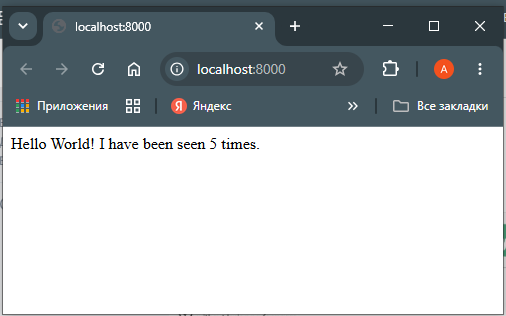
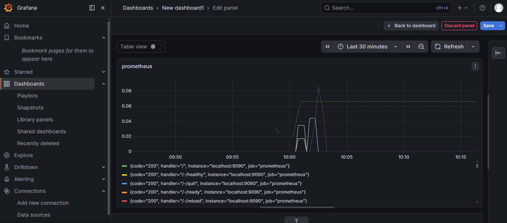

# Лаб. работа №6 Docker compose

## 1. Cоздаем связку из двух контейнеров Flask+Redis в подкаталоге `flask-redis`:

### 1.1 Пишем приложение на python:  
- в `requirements.txt` указываем зависимости:
```txt
flask
redis
```
- в `app.py` пишем код python:  
```python
import redis
from flask import Flask

app = Flask(__name__)
cache = redis.Redis(host='redis', port=6379)

def get_hit_count():
    return cache.incr('hits')

@app.route('/')
def hello():
    count = get_hit_count()
    return 'Hello World! I have been seen {} times.\n'.format(count)
```
При этом, используем файл с переменными окружения `.env` - модуль load_dotenv автоматически считывает значения из этого файла  

## 1.2. пишем dockerfile для сборки образа веб-приложения:  
- для сборки используем стартовый образ `python:3.12-slim`, определяем рабочую директорию приложения `/app`
- определяем переменные среды `FLASK_APP=app.py`, `FLASK_RUN_HOST=0.0.0.0`  
- копируем зависимости `requirements.txt` и устанавливаем через `pip install -r requirements.txt`  
- определяем внутренний порт контейнера, на который будем пробрасывать внешний порт для обращения к приложению `EXPOSE 5000`  
- копируем код python-приложения и запускаем через команду `CMD ["flask", "run", "--debug"]`
```dockerfile
FROM python:3.12-slim
WORKDIR /app
ENV FLASK_APP=app.py
ENV FLASK_RUN_HOST=0.0.0.0

COPY requirements.txt .

RUN pip install -r requirements.txt

EXPOSE 5000

COPY app.py .

CMD ["flask", "run", "--debug"]
```

## 1.3. Описываем файл `docker-compose.yml` для сборки стека `flask+redis`:  
```yml
services:
  web:
    build: .
    ports:
      - "8000:5000"
  
  redis:
    image: "redis:alpine"
```
## 1.4. Проверяем сборку docker compose 
командой `docker compose up -d`, при обращении к http://localhost:8000 должны получить вывод:  
```bash
$ curl http://localhost:8000
Hello World! I have been seen 6 times.  
$ curl http://localhost:8000
Hello World! I have been seen 7 times.
```
или в браузере:



Чтобы пересобрать оба сервиса в docker compose используем команды  
```bash
$ docker compose down
$ docker compose build
$ docker compose up -d
```

## 2. Собираем стек docker compose для Prometheus+Grafana в каталоге `promgrafana`  
### 2.1. создаем конфигурационный файл для Grafana в подпапке `grafana`  
```yml
apiVersion: 1

datasources:
- name: Prometheus
  type: prometheus
  url: http://prometheus:9090
  isDefault: true
  access: proxy
  editable: true
```
### 2.2. Создаем конфигурационный файл для Prometheus в подпапке `prometheus`
```yml
global:
  scrape_interval: 5s
  scrape_timeout: 3s
  evaluation_interval: 15s
alerting:
  alertmanagers:
  - static_configs:
    - targets: []
    scheme: http
    timeout: 10s
    api_version: v2
scrape_configs:
- job_name: prometheus
  honor_timestamps: true
  scrape_interval: 15s
  scrape_timeout: 10s
  metrics_path: /metrics
  scheme: http
  static_configs:
  - targets:
    - localhost:9090
```
### 2.3. Создаем docker-compose.yml для стека Prometheus+Grafana  
Указываем два сервиса `prometheus` и `grafana`. Внимательно следим за именами и опечатками в каталогах/именах сервисов.  
**Для prometheus:** 
- указываем образ `prom/prometheus` и имя контейнера `prometheus`, по которому grafana будет искать его через внутренний DNS докера.  
- аргументы для запуска сервиса prometheus `--config.file=/etc/prometheus/prometheus.yml`  
- указываем порты внешний:внутренний `9090:9090`, условия рестарта
- разделы для хранения данных: `./prometheus:/etc/prometheus` - здесь конфигурационный файл prometheus, `prom_data:/prometheus` зарезервирован.

**Для grafana:**
- указываем образ `grafana/grafana` и имя контейнера `grafana`  
- указываем порты внешний:внутренний `3000:3000`, условия рестарта  
- указываем в разделе `environment` переменные окружения: логин и пароль администратора сервиса
- разделы для хранения данных: `./grafana:/etc/grafana/provisioning/datasources` - здесь конфигурационный файл grafana, `grafana_data:/var/lib/grafana` зарезервирован.
```yml
services:
  prometheus:
    image: prom/prometheus
    container_name: prometheus
    command:
      - '--config.file=/etc/prometheus/prometheus.yml'
    ports:
      - 9090:9090
    restart: unless-stopped
    volumes:
      - ./prometheus:/etc/prometheus
      - prom_data:/prometheus

  grafana:
    image: grafana/grafana
    container_name: grafana
    ports:
      - 3000:3000
    restart: unless-stopped
    environment:
      - GF_SECURITY_ADMIN_USER=admin
      - GF_SECURITY_ADMIN_PASSWORD=grafana
    volumes:
      - ./grafana:/etc/grafana/provisioning/datasources
      - grafana_data:/var/lib/grafana
volumes:
  prom_data:
  grafana_data:
```
Проверяем стек командой `docker compose up -d`, входим в grafana и настраиваем дашборд для prometheus:


